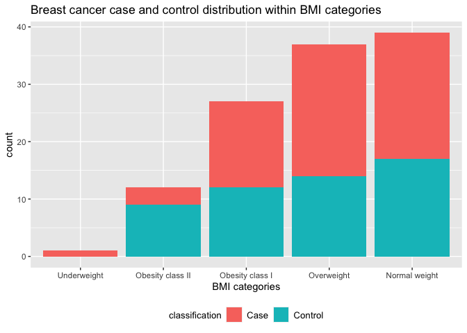

P8451 Assignment 1
================
2023-01-18

``` r
library(tidyverse)
```

    ## ── Attaching packages ─────────────────────────────────────── tidyverse 1.3.2 ──
    ## ✔ ggplot2 3.3.6      ✔ purrr   0.3.4 
    ## ✔ tibble  3.1.8      ✔ dplyr   1.0.10
    ## ✔ tidyr   1.2.0      ✔ stringr 1.4.1 
    ## ✔ readr   2.1.2      ✔ forcats 0.5.2 
    ## ── Conflicts ────────────────────────────────────────── tidyverse_conflicts() ──
    ## ✖ dplyr::filter() masks stats::filter()
    ## ✖ dplyr::lag()    masks stats::lag()

``` r
library(psych)
```

    ## 
    ## Attaching package: 'psych'
    ## 
    ## The following objects are masked from 'package:ggplot2':
    ## 
    ##     %+%, alpha

``` r
library(dplyr)
```

## Importing and Cleaning Data

``` r
bcdata <- read_csv("data/bcdata_Assignment1.csv") %>%
  janitor::clean_names() %>%
  drop_na()
```

    ## Rows: 116 Columns: 10
    ## ── Column specification ────────────────────────────────────────────────────────
    ## Delimiter: ","
    ## dbl (10): Age, BMI, Glucose, Insulin, HOMA, Leptin, Adiponectin, Resistin, M...
    ## 
    ## ℹ Use `spec()` to retrieve the full column specification for this data.
    ## ℹ Specify the column types or set `show_col_types = FALSE` to quiet this message.

## Question 1

Construct a table providing summaries of the quantitative features of
the dataset. Summaries should include the mean, median, minimum value,
and maximum value.

``` r
  describe(bcdata) %>%
  knitr::kable()
```

|                | vars |   n |       mean |         sd |     median |    trimmed |        mad |        min |        max |      range |       skew |   kurtosis |         se |
|:---------------|-----:|----:|-----------:|-----------:|-----------:|-----------:|-----------:|-----------:|-----------:|-----------:|-----------:|-----------:|-----------:|
| age            |    1 | 116 |  57.301724 |  16.112766 |  56.000000 |  57.287234 |  18.532500 | 24.0000000 |   89.00000 |   65.00000 |  0.0173736 | -1.0269231 |  1.4960327 |
| bmi            |    2 | 116 |  27.582111 |   5.020136 |  27.662416 |  27.423819 |   6.393859 | 18.3700000 |   38.57876 |   20.20876 |  0.1657766 | -0.9703568 |  0.4661079 |
| glucose        |    3 | 116 |  97.793103 |  22.525162 |  92.000000 |  94.148936 |  11.860800 | 60.0000000 |  201.00000 |  141.00000 |  2.5266218 |  8.3554901 |  2.0914088 |
| insulin        |    4 | 116 |  10.012086 |  10.067768 |   5.924500 |   7.833085 |   3.652385 |  2.4320000 |   58.46000 |   56.02800 |  2.5112894 |  6.9573571 |  0.9347688 |
| homa           |    5 | 116 |   2.694988 |   3.642043 |   1.380939 |   1.902923 |   0.961909 |  0.4674087 |   25.05034 |   24.58293 |  3.7140651 | 16.4506284 |  0.3381552 |
| leptin         |    6 | 116 |  26.615080 |  19.183294 |  20.271000 |  23.882835 |  15.547211 |  4.3110000 |   90.28000 |   85.96900 |  1.2758638 |  1.2475319 |  1.7811241 |
| adiponectin    |    7 | 116 |  10.180874 |   6.843341 |   8.352692 |   9.139724 |   4.387729 |  1.6560200 |   38.04000 |   36.38398 |  1.7710236 |  3.5955672 |  0.6353883 |
| resistin       |    8 | 116 |  14.725966 |  12.390646 |  10.827740 |  12.474596 |   7.753264 |  3.2100000 |   82.10000 |   78.89000 |  2.5111540 |  8.2815434 |  1.1504426 |
| mcp_1          |    9 | 116 | 534.647000 | 345.912663 | 471.322500 | 490.602415 | 304.612031 | 45.8430000 | 1698.44000 | 1652.59700 |  1.3878086 |  2.3273077 | 32.1171845 |
| classification |   10 | 116 |   1.551724 |   0.499475 |   2.000000 |   1.563830 |   0.000000 |  1.0000000 |    2.00000 |    1.00000 | -0.2053286 | -1.9746406 |  0.0463751 |

## Question 2

Recode BMI into the WHO-defined categories below:

-   Severely underweight - BMI less than 16.5 kg/m^2

-   Underweight - BMI under 18.5 kg/m^2

-   Normal weight - BMI greater than or equal to 18.5 to 24.9 kg/m^2

-   Overweight - BMI greater than or equal to 25 to 29.9 kg/m^2

-   Obesity class I - BMI 30 to 34.9 kg/m^2

-   Obesity class II - BMI 35 to 39.9 kg/m^2

-   Obesity class III - BMI greater than or equal to 40 kg/m^2

``` r
bcdata$bmi_categories <- as.factor( ifelse (bcdata$bmi < 16.5, 'Severely Underweight',
                                    ifelse (bcdata$bmi < 18.5, 'Underweight',
                                    ifelse (bcdata$bmi < 24.9, 'Normal weight',
                                    ifelse (bcdata$bmi < 29.9, 'Overweight',
                                    ifelse (bcdata$bmi < 34.9, 'Obesity class I',
                                    ifelse (bcdata$bmi < 39.9, 'Obesity class II',
                                    ifelse (bcdata$bmi < 40, 'Obesity class III'))))))))

bcdata %>%
  group_by(bmi_categories) %>%
  summarise(n_obs = n()) %>%
  knitr::kable()
```

| bmi_categories   | n_obs |
|:-----------------|------:|
| Normal weight    |    39 |
| Obesity class I  |    27 |
| Obesity class II |    12 |
| Overweight       |    37 |
| Underweight      |     1 |

## Question 3

Create a bar chart showing the proportion of breast cancer cases and
controls within each BMI category. (That is, the graph should clearly
show what % of each BMI category are cases and what % are controls)

``` r
bcdata = 
  bcdata %>%
  mutate(
    classification = recode(classification ,
                            "1" = "Control",
                            "2" = "Case")
  ) 

bcdata = 
  bcdata %>%
  group_by(bmi_categories) %>%
  mutate(count = n()) %>%
  mutate(bmi_categories = fct_reorder(bmi_categories, count))

ggplot(data = bcdata, (aes(x = reorder(bmi_categories, count), fill = classification))) +
  geom_bar() +
  labs(
    title = "Breast cancer case and control distribution within BMI categories",
    x = "BMI categories") +
  theme(legend.position = "bottom") +
  theme(legend.title = element_text(size = 10),
        legend.text = element_text(size = 10))
```

<!-- -->

## Question 4

Construct a basic regression model using breast cancer classification as
the outcome and glucose, HOMA-IR, leptin, BMI (continuous) and age as
the independent variables. Fill in the beta estimate and 95% confidence
interval associated with a 1-unit change in HOMA-IR

``` r
bcdata = 
  bcdata %>%
  mutate(
    classification = recode(classification ,
                            "Control" = 0,
                            "Case" = 1)
  ) 

fit_logistic = 
  bcdata %>%
  glm(classification ~ glucose + homa + leptin + bmi + age, data = ., family = binomial()) %>%
  broom::tidy()

fit_logistic %>%
  mutate(OR = exp(estimate),
         CI_lower = exp(estimate - 1.96*std.error),
         CI_upper = exp(estimate + 1.95*std.error)) %>%
  select(term, estimate, OR, CI_lower, CI_upper, p.value) %>%
  knitr::kable(digits = 3)
```

| term        | estimate |    OR | CI_lower | CI_upper | p.value |
|:------------|---------:|------:|---------:|---------:|--------:|
| (Intercept) |   -3.626 | 0.027 |    0.000 |    2.629 |   0.124 |
| glucose     |    0.082 | 1.085 |    1.036 |    1.136 |   0.001 |
| homa        |    0.274 | 1.315 |    0.939 |    1.839 |   0.111 |
| leptin      |   -0.009 | 0.991 |    0.961 |    1.022 |   0.587 |
| bmi         |   -0.104 | 0.901 |    0.806 |    1.006 |   0.066 |
| age         |   -0.023 | 0.977 |    0.950 |    1.005 |   0.111 |

The beta estimate associated with a 1-unit change in HOMA-IR is 0.274.
The OR is 1.315. The 95% CI is (0.939, 1.849).

## Question 5

Constuct a linear regression model using insulin as the outcome and BMI
(continuous), age, and glucose as the independent variables. Fill in the
beta estimate and 95% confidence interval associated with a 1-unit
change in age.

``` r
fit_linear = 
  lm(insulin ~ bmi + age + glucose, data = bcdata)

fit_linear %>%
  broom::tidy() %>%
  mutate(OR = exp(estimate),
         CI_lower = exp(estimate - 1.96*std.error),
         CI_upper = exp(estimate + 1.96*std.error)) %>%
  select(term, estimate, OR, CI_lower, CI_upper, p.value) %>%
  knitr::kable(digits = 3)
```

| term        | estimate |    OR | CI_lower | CI_upper | p.value |
|:------------|---------:|------:|---------:|---------:|--------:|
| (Intercept) |  -13.496 | 0.000 |    0.000 |    0.134 |   0.023 |
| bmi         |    0.150 | 1.161 |    0.842 |    1.601 |   0.363 |
| age         |   -0.054 | 0.947 |    0.856 |    1.049 |   0.301 |
| glucose     |    0.230 | 1.258 |    1.169 |    1.354 |   0.000 |

The beta estimate associated with a 1-unit change in age is -0.054. The
OR is 0.947. The 95% CI is (0.856, 1.049).
